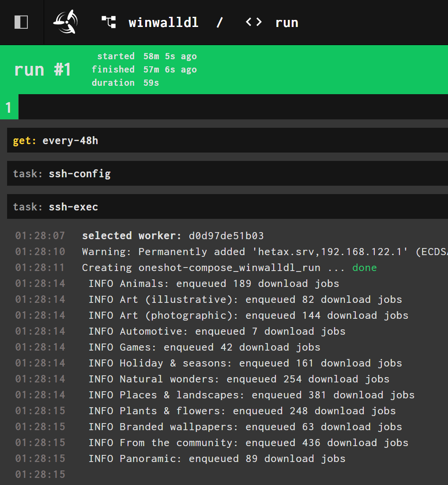

# winwalldl

Batch downloader of Windows 10 wallpapers [from Microsoft][url]

[url]: https://support.microsoft.com/en-us/windows/wallpapers-5cfa0cc7-b75a-165a-467b-c95abaf5dc2a#ID0EBD=Windows_10

## Features

* Concurrent downloads
* Stoppable/resumable
* Optional nesting by categories

## Usage

```sh
$ bundle exec ruby main.rb dl --help
```

Example cronjob output:


